<div align="center">

# Appium Android E2E Testing Framework

### Production-grade mobile test automation for Android — Page Object Model · BrowserStack · Allure Reports

[](https://openjdk.org/projects/jdk/17/)
[](https://appium.io)
[](https://testng.org)
[](https://maven.apache.org)
[](https://www.browserstack.com/app-automate)
[](https://allurereport.org)
[](LICENSE)

<br/>

> **End-to-end Android automation built on Appium 9, TestNG, and the Page Object Model.**  
> Run smoke suites locally against a real device or push to BrowserStack App Automate with a single Maven profile switch.

</div>

---

## Table of Contents

- [Live Showcase](#live-showcase)
- [What's Tested](#whats-tested)
- [Architecture](#architecture)
- [Tech Stack](#tech-stack)
- [Project Structure](#project-structure)
- [Prerequisites](#prerequisites)
- [Quick Start — Local](#quick-start--local)
- [Cloud Execution — BrowserStack](#cloud-execution--browserstack)
- [Allure Reporting](#allure-reporting)
- [Test Suite Overview](#test-suite-overview)
- [Page Object Reference](#page-object-reference)
- [Configuration Reference](#configuration-reference)
- [Contributing](#contributing)

---

## Live Showcase

<p align="center">
  
</p>

---

## What's Tested

The framework targets **Toucher** — an Android bowls scoring app (`com.toucher`) — and covers the following smoke flows:

| Test | Scenario | Expected |
|---|---|---|
| `openMobileApp` | Full happy path — login → rules → 3 scored rounds with WE/They teams | Pass |
| `openMobileApp1` | Successful login only | Pass |
| `openMobileApp2` | Login with invalid email (`test@outloo.com`) | Fail (negative test) |
| `openMobileApp3` | Login → Round 1 with invalid short username `"E"` | Fail (validation gate) |
| `openMobileApp4` | Login → 3 empty rounds (no score data) then navigate back | Pass / edge case |

---

## Architecture

```
┌─────────────────────────────────────────────────────┐
│                    Test Layer (TestNG)               │
│   AppTest.java — @BeforeMethod / @Test / @AfterMethod│
└───────────────────────┬─────────────────────────────┘
                        │ delegates to
     ┌──────────────────┼──────────────────────────────┐
     │                  │                              │
     ▼                  ▼                              ▼
LoginPage.java    ScorePage.java            AddUserPage.java
(authentication)  (rounds + scoring)        (WE / They members)
     │                  │                              │
     └──────────────────┴──────────────────────────────┘
                        │ all use
                        ▼
              AppiumDriver (AppTest helpers)
         click() · write() · scrollUntilVisible()
                  performSwipe()
                        │
          ┌─────────────┴──────────────┐
          ▼                            ▼
  Local Appium Server          BrowserStack Hub
  (UiAutomator2 · USB)         (App Automate cloud)
          │                            │
          ▼                            ▼
   Physical / Emulator          Google Pixel 8
   Android Device               Android 14 (remote)
```

### Key design decisions

- **Single driver instance per test method** — `@BeforeMethod` creates and `@AfterMethod` quits, preventing state leakage between tests.
- **DriverFactory abstraction** — one `createDriver()` call detects local vs BrowserStack via a system property (`-Dexecution=browserstack`), so page objects are environment-agnostic.
- **Helper delegation** — `AppTest` exposes `click()`, `write()`, `scrollUntilElementIsVisible()`, and `performSwipe()` as reusable primitives; page objects never touch `driver` directly except for construction.

---

## Tech Stack

| Layer | Tool | Version |
|---|---|---|
| Language | Java | 17 |
| Mobile automation | Appium Java Client | 9.2.3 |
| Web driver core | Selenium Java | 4.23.0 |
| Test runner | TestNG | 7.10.2 |
| Build & dependency management | Maven (Surefire 3.0.0-M5) | 3.x |
| Cloud device farm | BrowserStack App Automate | — |
| Android automation engine | UiAutomator2 | — |
| Test reporting | Allure TestNG | 2.29.1 |
| Logging | Logback Classic | 1.5.12 |

---

## Project Structure

```
AndroidTesting/
├── src/
│   └── test/
│       ├── java/
│       │   ├── AppTest.java          # Base test + shared driver helpers
│       │   ├── LoginPage.java        # POM — Sign In screen
│       │   ├── ScorePage.java        # POM — Scoring / Round management
│       │   ├── AddUserPage.java      # POM — WE / They member management
│       │   └── config/
│       │       └── DriverFactory.java  # Local + BrowserStack driver factory
│       └── resources/
│           └── browserstack.properties # BrowserStack capability overrides
├── showcase/
│   ├── appium-mobile-showcase.html   # Animated Appium framework walkthrough
│   ├── Playwright-e2e.html           # Playwright showcase
│   ├── selenium-e2e-showcase.html    # Selenium showcase
│   └── assets/                       # Screenshots used in slideshows
├── allure-results/                   # Raw Allure JSON (git-ignored in CI)
├── browserstack.yml                  # BrowserStack YAML config (env vars for secrets)
├── testng.xml                        # Local test suite definition
├── testng-browserstack.xml           # BrowserStack suite definition
└── pom.xml                           # Maven build descriptor
```

---

## Prerequisites

| Requirement | Notes |
|---|---|
| JDK 17+ | `java -version` to verify |
| Maven 3.8+ | `mvn -version` to verify |
| Appium Server 2.x | `npm install -g appium` then `appium driver install uiautomator2` |
| Android SDK / ADB | Required for local USB/emulator runs |
| Android device or emulator | Pixel 5 · Android 14 (default config) |
| BrowserStack account | Only needed for cloud runs — free trial available |

---

## Quick Start — Local

### 1. Clone and install

```bash
git clone <your-repo-url>
cd AndroidTesting
mvn install -DskipTests
```

### 2. Start Appium server

```bash
appium
# Server starts on http://127.0.0.1:4723
```

### 3. Connect your device

```bash
adb devices
# Confirm your device UDID appears (e.g. 11281FDD4001CN)
```

Update `DriverFactory.java` if your device UDID differs:

```java
capabilities.setCapability("appium:udid", "YOUR_DEVICE_UDID");
```

### 4. Run the smoke suite

```bash
mvn test
```

> By default this runs `testng.xml` (SmokeTesting suite → `AppTest`).

---

## Cloud Execution — BrowserStack

### 1. Set credentials as environment variables

```bash
export BROWSERSTACK_USERNAME=your_username
export BROWSERSTACK_ACCESS_KEY=your_access_key
```

> Never commit credentials. The `browserstack.yml` and `DriverFactory` both read these at runtime.

### 2. Upload your APK to BrowserStack

```bash
curl -u "$BROWSERSTACK_USERNAME:$BROWSERSTACK_ACCESS_KEY" \
  -X POST "https://api-cloud.browserstack.com/app-automate/upload" \
  -F "file=@/path/to/toucher.apk"
# Copy the returned bs:// app ID
```

### 3. Set the app ID and run

```bash
# In src/test/resources/browserstack.properties
# browserstack.app=bs://YOUR_APP_ID

mvn test -Pbrowserstack
```

BrowserStack runs on **Google Pixel 8 · Android 14** as configured in `browserstack.yml`. Each test session gets its own session name (injected via `method.getName()` in `@BeforeMethod`), with debug screenshots and network logs enabled.

---

## Allure Reporting

After any test run, generate and serve the interactive report:

```bash
# Serve live (opens browser automatically)
allure serve allure-results

# Or generate static HTML
allure generate allure-results --clean -o allure-report
open allure-report/index.html
```

The report shows per-test pass/fail status, step-level timelines, and (when run on BrowserStack) attached screenshots and device logs.

---

## Test Suite Overview

```xml
<!-- testng.xml -->
<suite name="SmokeTesting">
  <listeners>
    <listener class-name="io.qameta.allure.testng.AllureTestNg"/>
  </listeners>
  <test name="MyAppTest">
    <classes>
      <class name="AppTest"/>
    </classes>
  </test>
</suite>
```

| Priority | Method | Flow |
|---|---|---|
| 1 | `openMobileApp` | Login → Rules → 3 rounds (score + WE + They members each) → back |
| 2 | `openMobileApp1` | Login → assert success |
| 2 | `openMobileApp2` | Login with typo email → expect failure |
| 3 | `openMobileApp3` | Login → Round 1 → invalid short member name → expect failure |
| 4 | `openMobileApp4` | Login → 3 empty rounds → back navigation |

---

## Page Object Reference

### `LoginPage`

| Method | Description |
|---|---|
| `login(email, password)` | Fills email + password fields, taps Sign In, validates "Bowls Rules" header appears |

Locators use `AppiumBy.androidUIAutomator` (UiSelector text matching) and XPath for the header.

### `ScorePage`

| Method | Description |
|---|---|
| `rulescreen()` | Navigates through 6 rule screens via consecutive Next taps |
| `AddRoundName(name)` | Types a round name into the first `EditText` |
| `AddScore(String[] arr)` | Fills score `EditText` instances 1–12 from the supplied array |
| `changeround()` | Taps the change-round SVG button |
| `back_from_current_screen()` | Taps the back `ViewGroup` button |

### `AddUserPage`

| Method | Description |
|---|---|
| `Add_WE_Members(names[], count)` | Opens WE panel → adds N players by name → returns to scoring |
| `Add_They_Members(names[], count)` | Opens THEY panel → adds N players by name → returns to scoring |

### `AppTest` (base helpers)

| Method | Description |
|---|---|
| `click(By)` | Waits for loader → finds element → clicks |
| `write(By, String)` | Waits for visibility → sends keys |
| `scrollUntilElementIsVisible(By, maxScrolls)` | Swipes bottom-to-top until element appears |
| `performSwipe(startX, startY, endX, endY, durationMs)` | Low-level `PointerInput` swipe gesture |

---

## Configuration Reference

### `browserstack.properties` (in `src/test/resources/`)

```properties
browserstack.hub=hub-cloud.browserstack.com
browserstack.device=Google Pixel 8
browserstack.os.version=14.0
browserstack.project=Toucher App Tests
browserstack.build=Toucher Build
browserstack.app=bs://YOUR_APP_ID
browserstack.app.package=com.toucher
browserstack.app.activity=com.toucher.MainActivity
```

### Maven profiles

| Profile | Command | Suite file |
|---|---|---|
| Local (default) | `mvn test` | `testng.xml` |
| BrowserStack | `mvn test -Pbrowserstack` | `testng-browserstack.xml` |

---

## Contributing

1. Fork the repository and create a feature branch.
2. Follow the existing Page Object pattern — one class per screen.
3. Add your test method to `AppTest` or a new `*Page` class with its locators.
4. Verify locally before raising a PR: `mvn test`
5. Open a pull request with a description of the scenario covered.

---

<div align="center">

Built with **Appium 9 · Java 17 · TestNG · BrowserStack · Allure**

</div>
